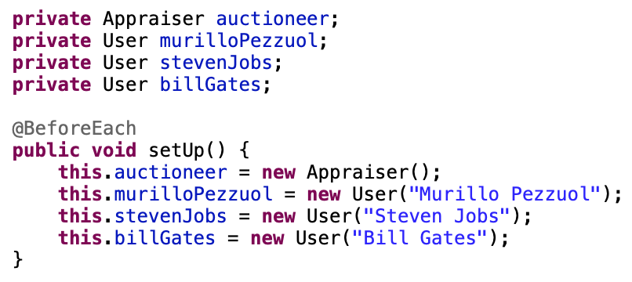

# TDD with Java

Design for automated test studies.

## Index :pushpin:

- [Examples](#examples)
- [TDD](#tdd)
- [Dependencies Used](#maven)

## Examples <a name="examples"></a>:white_check_mark:

- First Test.

```java
@Test
public void mustUnderstandLancesOrderAsc() {
    // 1. Scenario
    User userMurillo = new User("Murillo");
    User userGabriella = new User("Gabriella");
    User userRaul = new User("Raul");
	
    Auction auction = new Auction("Playstation 4");
	
    auction.propose(new Lance(userMurillo, 110.0));
    auction.propose(new Lance(userGabriella, 431.45));
    auction.propose(new Lance(userRaul, 550.0));
	
    // 2. Action
    Appraiser auctioneer = new Appraiser();
    auctioneer.evaluate(auction);
	
    // 3. Validation
    double higherExpected = 550.0;
    double lowerExpected = 110.0;
	
    // 4. Execution
    assertEquals(higherExpected, auctioneer.getHighestLance(), 0.00001);
    assertEquals(lowerExpected, auctioneer.getLowerLance(), 0.00001);
}
```

- First Test with refactoring.

```java
@Test
public void mustUnderstandLancesOrderAsc() {
    Auction auction = new AuctionBuilder().to("Macbook Pro 5")
            .lance(murilloPezzuol, 110.00)
            .lance(murilloPezzuol, 431.45)
            .lance(billGates, 550.00)
            .build();
    
    auctioneer.evaluate(auction);
    
    double higherExpected = 550.00;
    double lowerExpected = 110.00;
    
    assertEquals(higherExpected, auctioneer.getHighestLance(), 0.00001);
    assertEquals(lowerExpected, auctioneer.getLowerLance(), 0.00001);
}
```

- Using _`@Before(jUnit)`_ or _`@BeforeEach(jupiter)`_



- Testing list values

```java
@Test
public void musFindTheBiggestLances() {
    Auction auction = new AuctionBuilder().to("PS5")
            .lance(murilloPezzuol, 110.0)
            .lance(stevenJobs, 3031.45)
            .lance(billGates, 550.0)
            .lance(murilloPezzuol, 1550.0)
            .lance(stevenJobs, 50.0)
            .build();
    
    auctioneer.evaluate(auction);
    
    double firstHighest = 3031.45;
    double secondHighest = 1550.0;
    double thirdHighest = 550.00;
    
    assertEquals(4, auctioneer.getHighestLances(4).size(), 0.00001);
    assertEquals(5, auctioneer.getHighestLances(10).size(), 0.00001);
    
    List<Lance> highestLances = auctioneer.getHighestLances(3);
    assertEquals(3, highestLances.size(), 0.00001);//Size List
    assertEquals(firstHighest, highestLances.get(0).getValue(), 0.00001);
    assertEquals(secondHighest, highestLances.get(1).getValue(), 0.00001);
    assertEquals(thirdHighest, highestLances.get(2).getValue(), 0.00001);
}
```

- Handling exceptions

```java
@Test // or use Expected with jUnit
public void shouldNotEvaluateAuctionWithoutLances() {
    Auction auction = new AuctionBuilder().to("Macbook Pro 5").build();
    Assertions.assertThrows(RuntimeException.class, () -> {
            auctioneer.evaluate(auction);
        });
}
```

- Using Hamcrest

```java
@Test
public void mustUnderstandLancesOrderAsc() {
    Auction auction = new AuctionBuilder().to("Macbook Pro 5")
            .lance(murilloPezzuol, 110.00)
            .lance(murilloPezzuol, 431.45)
            .lance(billGates, 550.00)
            .build();
    
    auctioneer.evaluate(auction);
    
    double higherExpected = 550.00;
    double lowerExpected = 110.00;
    
    // Using Hamcrest
    assertThat(auctioneer.getHighestLance(), equalTo(higherExpected));
    assertThat(auctioneer.getLowerLance(), equalTo(lowerExpected));
}
```

- Using Hamcrest to validate lists

```java
@Test
public void musFindTheBiggestLances() {
    Auction auction = new AuctionBuilder().to("PS5")
            .lance(murilloPezzuol, 110.0)
            .lance(stevenJobs, 3031.45)
            .lance(billGates, 550.0)
            .lance(murilloPezzuol, 1550.0)
            .lance(stevenJobs, 50.0)
            .build();
    
    auctioneer.evaluate(auction);
    
    assertEquals(4, auctioneer.getHighestLances(4).size(), 0.00001);
    assertEquals(5, auctioneer.getHighestLances(10).size(), 0.00001);
    
    List<Lance> highestLances = auctioneer.getHighestLances(3);
    
    assertEquals(3, highestLances.size(), 0.00001);//Size List
    
    // Using Hamcrest (hasItems use method 'hashcode' and 'equals')
    assertThat(highestLances, hasItems(
            new Lance(stevenJobs, 3031.45),
            new Lance(murilloPezzuol, 1550.0),
            new Lance(billGates, 550.0)
            ));
}
```

## TDD <a name="tdd"></a>:chart_with_upwards_trend:

- Demonstrating the magic of TDD in a small gif of the project.


## Dependencies Used <a name="maven"></a>:link:

- JUnit Jupiter 5.6.2
- Hamcrest 1.3
